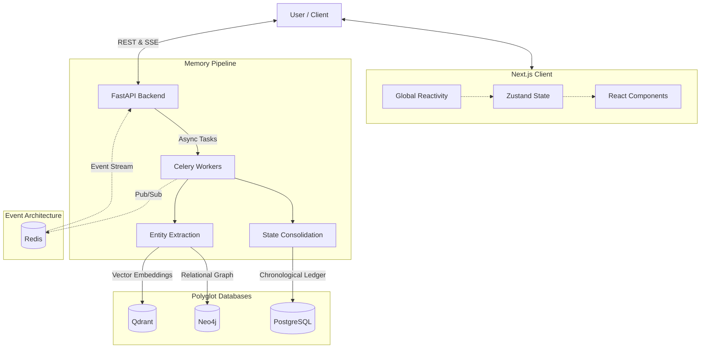
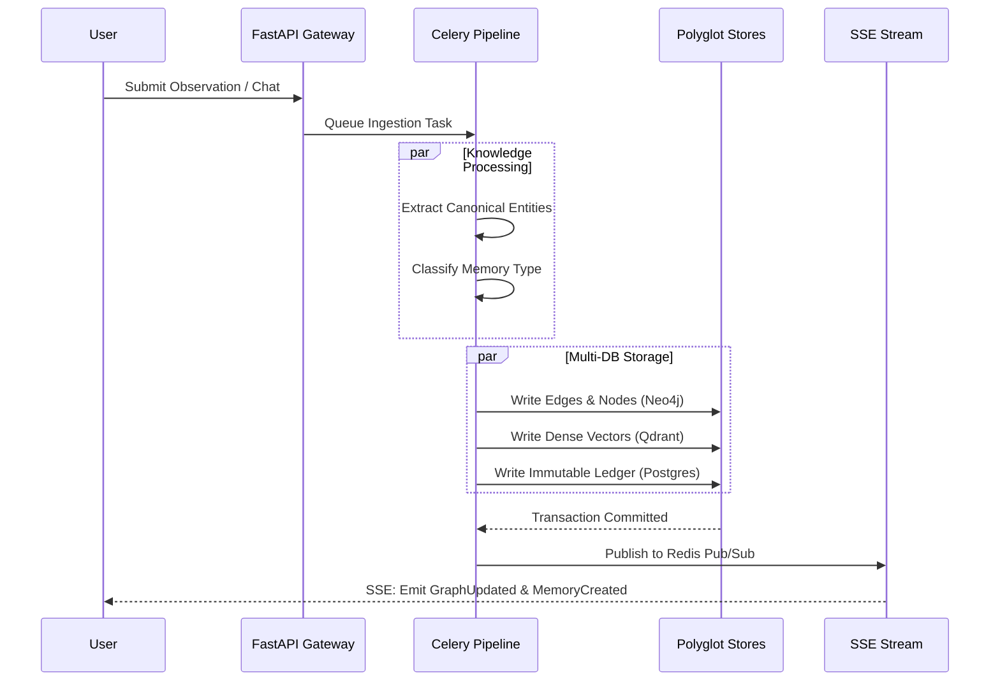

<div align="center">

# Memora

**Memory Operating System for persistent context generation and knowledge retrieval.**

Memora transforms isolated, stateless interactions into an enduring, interactive knowledge graph. Engineered with advanced entity extraction, semantic retrieval, and real-time event streaming, it provides autonomous, long-term memory for intelligent systems.


</div>

---

## Why Memora Exists

Current Large Language Models (LLMs) are inherently stateless. While traditional RAG (Retrieval-Augmented Generation) systems attempt to solve this by dumping conversational history into a vector database, this approach breaks down at scale. 

**The Problem:**
* **Context limits:** Context windows are temporary, leading to eventual amnesia.
* **Fragmentation:** Chat history becomes a disconnected sequence of linear documents.
* **Trapped Knowledge:** Facts are buried within unstructured conversation logs.
* **Retrieval degradation:** As memory scales, flat vector retrieval returns noisy, irrelevant context.

**The Memora Approach:**
Memora operates as a persistent Memory OS. It parses data in real-time, extracts canonical entities, and maps relationships into a highly structured graph. Instead of retrieving raw conversation logs, Memora reconstructs high-dimensional context dynamically, ensuring AI systems can leverage years of historical knowledge with sub-second latency and zero hallucination risk.

## Architecture Highlights

Memora is a complex, distributed AI system, utilizing specialized databases to handle distinct workloads.

* **Polyglot Persistence:** We decouple storage based on access patterns. Relational ledgers live in Postgres, high-dimensional dense vectors in Qdrant, and multi-hop entity relationships in Neo4j.
* **Graph-First Retrieval:** By extracting a canonical taxonomy into a property graph, Memora injects deterministic, structural context into reasoning engines, vastly outperforming flat semantic search.
* **Event-Driven Reactivity:** A Redis-backed Pub/Sub architecture feeds a Server-Sent Events (SSE) pipeline, broadcasting state mutations to the Next.js frontend with zero polling overhead.
* **Long-Term Memory Design:** Data is asynchronously ingested, parsed by Celery workers, and categorized into episodic, semantic, and procedural states without blocking the primary user thread.

## System Architecture



## Memory Flow



## Feature Showcase

### Memory Engine
* **Cognitive Stratification:** Categorizes data into episodic (events), semantic (facts), emotional (sentiment), and procedural (rules) memory.
* **Asynchronous Ingestion:** Heavy NLP and extraction workloads run in background workers, ensuring a non-blocking user experience.
* **Immutable Ledgers:** Every memory modification is historically versioned for absolute forensic traceability.

### Knowledge Graph
* **Automated Extraction:** Uses LLMs to dynamically parse unstructured input into nodes and edges.
* **Relationship Visualization:** Renders interactive, force-directed 2D graphs to explore memory clusters spatially.
* **Canonical Deduplication:** Prevents entity duplication by dynamically linking new observations to existing graph nodes.

### Search & Retrieval
* **Vector Semantic Search:** Retrieves context based on conceptual meaning using HuggingFace embeddings.
* **Dynamic Context Assembly:** Synthesizes relevant graph sub-networks and episodic logs to augment LLM prompts.
* **Multi-hop Traversal:** Leverages Cypher queries to understand complex relationships (e.g., "Where does the CEO of X live?").

### Timeline
* **Chronological Navigation:** A scrolling ledger of state changes over time.
* **Event Filtering:** Isolate memories by type, source, or temporal proximity.
* **Audit Tracing:** View the precise origin and extraction metadata of any given fact.

### Explorer
* **Entity Workspaces:** Dedicated views for inspecting a specific entity and all its $N$-degree connections.
* **Knowledge Navigation:** Traverse the knowledge graph node-by-node to uncover hidden relational insights.
* **Fact Consolidation:** View all historical observations that contributed to an entity's current state.

### Event Architecture
* **Global Reactivity:** The UI updates instantly when background extraction completes.
* **SSE Pipelines:** Lightweight, unidirectional streams maintain connection stability with heartbeat timeouts.
* **Redis Pub/Sub:** Decouples the ingestion workers from the API tier, ensuring high scalability.

## Screenshots

<div align="center">
  
  <br/>
  <em>System Dashboard & Intelligence Overview</em>
</div>
<br/>
<div align="center">
  
  <br/>
  <em>Chat Workspace with Real-time Context Injection</em>
</div>
<br/>
<div align="center">
  
  <br/>
  <em>Interactive Knowledge Graph Visualization</em>
</div>
<br/>
<div align="center">
  
  <br/>
  <em>Entity Explorer & Fact Inspection</em>
</div>
<br/>
<div align="center">
  
  <br/>
  <em>Chronological Memory Timeline</em>
</div>
<br/>
<div align="center">
  
  <br/>
  <em>Memory Inspection Workspace</em>
</div>

## Tech Stack

| Layer | Technologies |
| :--- | :--- |
| **Frontend** | Next.js 16, React 19, TailwindCSS, Zustand, React Force Graph |
| **Backend** | FastAPI, Celery, SQLAlchemy, SSE Starlette |
| **AI Models** | HuggingFace Transformers, SentenceTransformers, LangChain |
| **Databases** | PostgreSQL (pgvector), Neo4j 5, Qdrant, Redis 7 |
| **Infrastructure** | Docker, Docker Compose |

## Repository Structure

```text
memora/
├── frontend/        # Next.js 16 application, Global Reactivity, UI components
├── backend/         # FastAPI, Celery workers, ML pipelines, API routing
│   ├── api/         # REST and SSE endpoints
│   ├── core/        # Reasoning engine, entity extractors, long-term memory logic
│   └── models/      # Pydantic schemas and SQLAlchemy ORM models
├── docker/          # Compose files, Dockerfiles, and database initialization scripts
├── docs/            # Architecture decision records and deployment documentation
└── tests/           # Backend integration and unit tests
```

## Getting Started

### Prerequisites
* Docker and Docker Compose
* Node.js v22+
* Python 3.11+

### Environment Setup
Create a `.env` file in the root directory based on `.env.example`:
```bash
cp .env.example .env
```

### Docker Setup (Recommended)
The fastest way to run Memora is via the provided Docker orchestration. This provisions all 4 databases and the microservices on an isolated bridge network.
```bash
cd docker
docker compose up --build
```

### Local Development

**Backend Startup**
```bash
cd backend
python -m venv .venv
source .venv/bin/activate
pip install -r ../requirements.txt
python -m uvicorn main:app --reload --port 8000
```

**Frontend Startup**
```bash
cd frontend
npm install
npm run dev
```

## Roadmap

- [ ] **Typed Graph Relationships:** Expansion of edge metadata to support bidirectional and temporal relationship types.
- [ ] **Enhanced Entity Extraction:** Support for custom schema enforcement during entity parsing.
- [ ] **Knowledge Synthesis:** Background cron workers that consolidate redundant semantic memories into higher-order concepts.
- [ ] **Advanced Memory Retrieval:** Hybrid search strategies combining exact-match Cypher queries with semantic Qdrant fallbacks.

## Contributing

Memora is currently maintained by the author and is not accepting external contributions. 

## License & Usage

This repository is publicly viewable for:
* Educational purposes
* Technical evaluation
* Portfolio review

All rights remain with the author. 

Written permission is required before:
* Reuse
* Redistribution
* Modification
* Commercial deployment

For permissions, please contact the repository owner.
