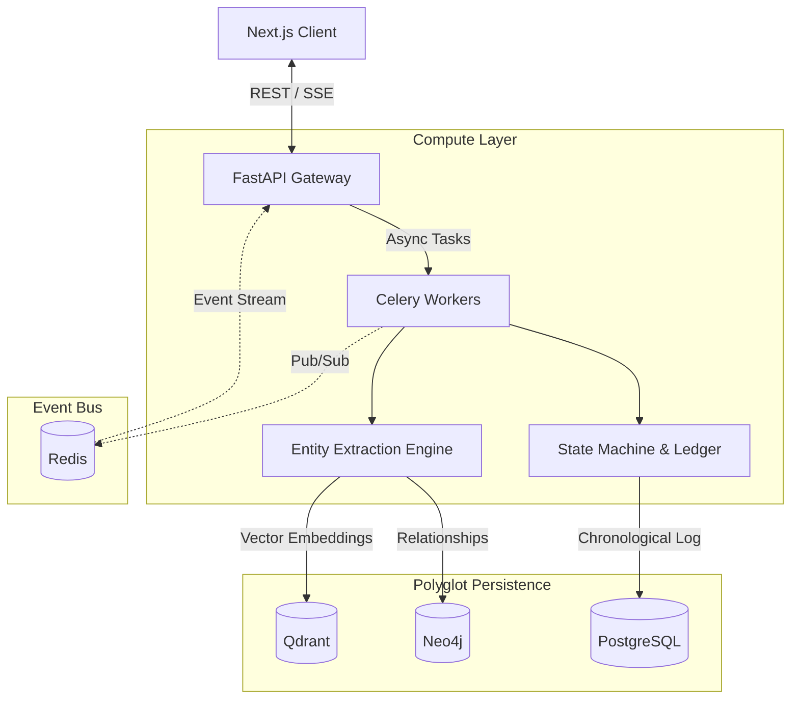
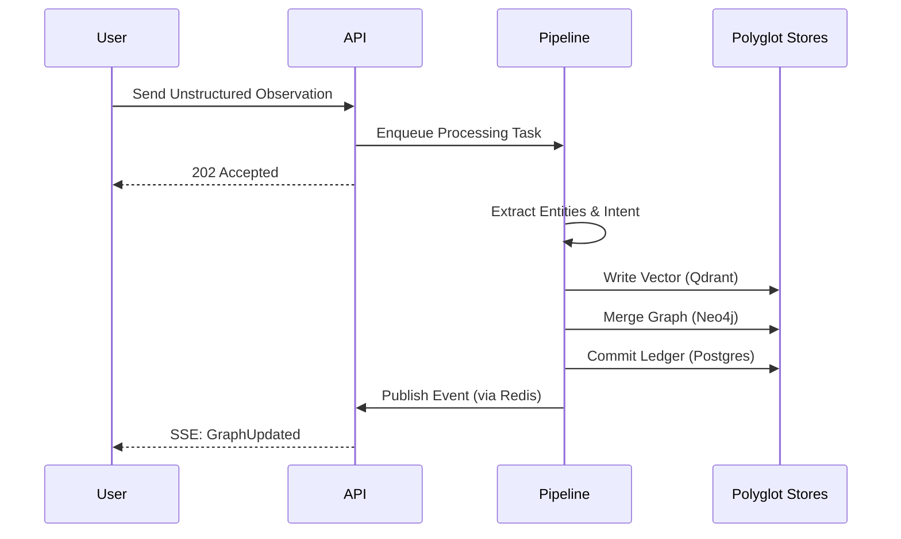

# Architecture

Memora is a sophisticated Memory Operating System designed to provide persistent context generation and high-dimensional knowledge retrieval. Unlike traditional stateless LLM integrations, Memora relies on polyglot persistence, asynchronous background processing, and real-time event streaming to construct a living memory graph.

## System Overview

The system is decoupled into a frontend client, a unified API gateway, a background memory pipeline, and four specialized storage engines. This separation ensures that heavy NLP extraction tasks do not block the primary user experience.

## High Level Architecture

## Component Responsibilities

* **Frontend (Next.js):** Manages user interaction, workspace rendering (Graph, Dashboard, Timeline), and global UI reactivity via Zustand and SSE.
* **API Gateway (FastAPI):** Exposes RESTful endpoints for memory ingestion, graph traversal, and chat. Acts as the SSE stream provider.
* **Background Pipeline (Celery):** Handles high-latency tasks such as embedding generation, LLM-based entity extraction, and knowledge graph construction.
* **Event Router (Redis/SSE):** Propagates state mutations from the background workers to the API gateway, which fans them out to connected clients.
* **Storage Engines:**
  * **PostgreSQL:** Source of truth for chronological ledgers, user accounts, and immutable state.
  * **Neo4j:** Property graph storing canonical entities and their multi-hop relationships.
  * **Qdrant:** High-performance vector database for semantic similarity search.

## Service Boundaries

Memora adheres to strict domain-driven service boundaries:
1. **Perception Layer:** Ingests raw unstructured text and normalizes it.
2. **Reasoning Layer:** Analyzes normalized data, determines cognitive routing (episodic vs. semantic), and extracts entities.
3. **Orchestration Layer:** Coordinates transaction commits across the polyglot databases.
4. **Presentation Layer:** Serves structured intelligence and context to the frontend or external LLMs.

## Data Flow

