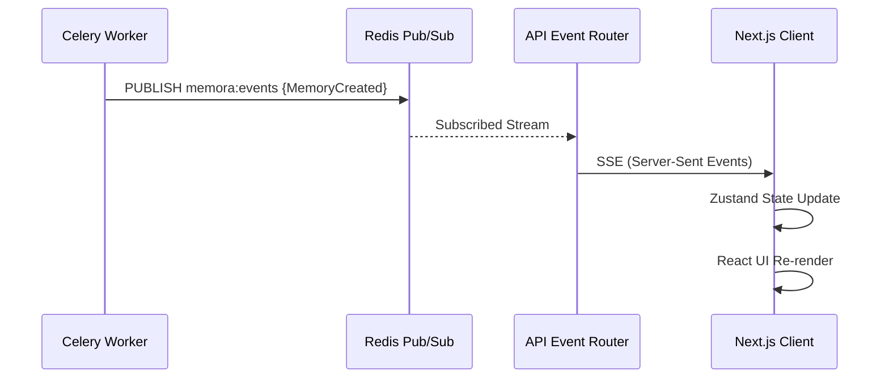

# Event Architecture

To provide an operating system experience, Memora must be instantly reactive. The Event System decouples background processing from the UI, ensuring that when heavy NLP extractions finish, the frontend updates in real-time without polling.

## Architecture

## Components

### Redis Pub/Sub
Because ingestion tasks are executed asynchronously by distributed Celery workers, they cannot return HTTP responses directly to the client. Instead, workers publish state changes (e.g., `MemoryCreated`, `GraphUpdated`) to a central Redis Pub/Sub channel (`memora:events`).

### Event Router & SSE
The FastAPI backend maintains a persistent Server-Sent Events (SSE) connection with the frontend via `/api/events/stream`.
An asynchronous generator listens to the Redis channel and yields payloads to the client.
* **Heartbeats:** To prevent reverse proxies or browsers from timing out the connection during idle periods, the router uses an `asyncio.wait_for` timeout loop to broadcast a `{"comment": "keepalive"}` ping every 15 seconds.

### Reactivity Pipeline
The frontend handles the SSE stream via the `memory-events.ts` utility. 
When an event arrives:
1. The payload is parsed.
2. Relevant SWR caches are automatically invalidated.
3. Zustand global state is updated.
4. The UI (Timeline, Graph, Dashboard) re-renders instantly to reflect the new memory architecture.
