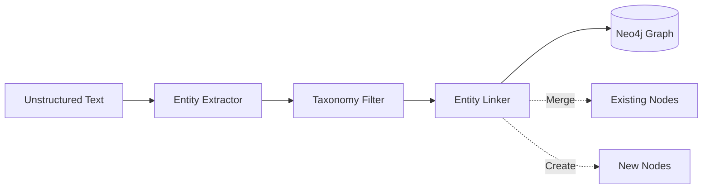

# Graph System

Memora’s Knowledge Graph is the structural foundation of the Memory OS. It maps the *relationships* between concepts, enabling multi-hop logical reasoning that flat vector databases cannot support.

## Graph Construction Flow

## Entity Extraction

When an observation is ingested, the system passes the unstructured text through an NLP extraction pipeline.
The pipeline utilizes zero-shot classification and named entity recognition (NER) to identify subjects, objects, and their relational predicates.

*Example Input:* "Parul works at DeepMind as a researcher."
*Extraction:* `(Parul) -[WORKS_AT]-> (DeepMind)`, `(Parul) -[ROLE]-> (Researcher)`

## Canonical Taxonomy

To prevent graph entropy (where "Deep Mind", "deepmind", and "Google DeepMind" create disconnected subgraphs), Memora enforces a strict canonical taxonomy. 
Entities are classified and normalized before storage. (See [Taxonomy](taxonomy.md) for detailed schemas).

## Neo4j Model

* **Nodes:** Represent canonical entities. They contain properties such as `id`, `label`, `canonical_name`, and `confidence_score`.
* **Edges (Relationships):** Represent the contextual linkage between nodes. Edges carry properties like `source_memory_id`, `timestamp`, and `weight`.

## Traversal

Retrieval relies on Cypher queries to perform N-degree multi-hop traversal. 
If the system needs to understand a user's professional network, it does not search for the word "network". Instead, it traverses `(User)-[:KNOWS]->(Person)-[:WORKS_AT]->(Company)`.

## Visualization

The graph is fully explorable via the frontend UI.
Using `react-force-graph-2d`, the frontend queries the `/api/graph/state` endpoint to render a real-time, interactive force-directed map of the user's cognitive space. Nodes are color-coded by taxonomy class, and edge thickness represents connection strength.
