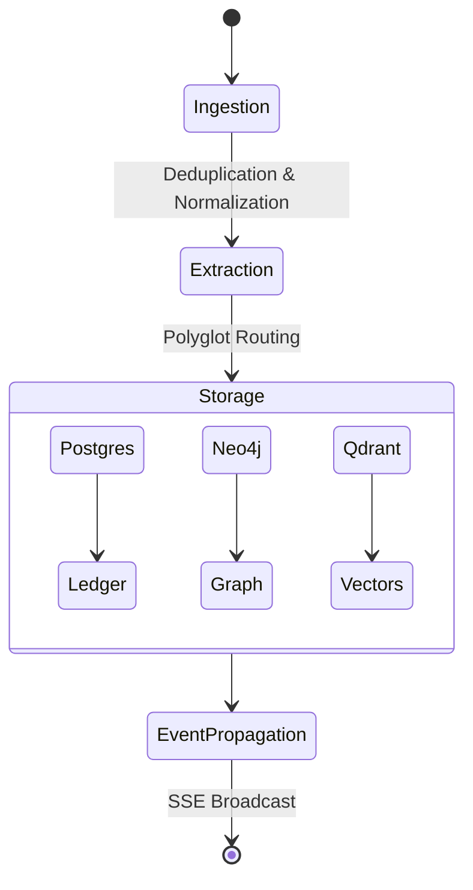

# Memory System

Memora's core capability is transforming transient, unstructured data into persistent, categorized memory. The system abandons flat text logging in favor of cognitive stratification.

## Memory Types

Data is routed into four distinct cognitive streams:
* **Episodic:** Sequential, point-in-time records of events and user interactions. Ideal for chronological reconstruction.
* **Semantic:** Distilled facts, entities, and generalized world knowledge decoupled from the context of when it was learned.
* **Emotional:** Sentiment extraction and emotional trajectory mapping, used to adapt tone and response behavior.
* **Procedural:** Implicit rules, system preferences, and instructional constraints that dictate *how* tasks should be executed.

## Memory Lifecycle

## Ingestion & Extraction

1. **Gateway Reception:** Unstructured text hits the FastAPI ingestion endpoint.
2. **Deduplication:** A fast similarity check runs against recent short-term memory to prevent echoing and identical re-ingestion.
3. **Pipeline Processing:** Celery workers pick up the payload and utilize HuggingFace/LangChain models to extract canonical entities and classify the memory type.

## Storage Routing

Instead of a monolithic database, memories are shattered and routed based on access pattern utility:
* **Vector Store (Qdrant):** The raw text is embedded and stored for fast semantic similarity search.
* **Property Graph (Neo4j):** Extracted entities (nodes) and their relationships (edges) are merged into the canonical knowledge graph.
* **Relational DB (Postgres):** The immutable event record and metadata are stored in the SQL ledger.

## Retrieval & Consolidation

Retrieval in Memora is hybrid. When a query is received:
1. **Semantic Search:** Qdrant finds conceptually similar past interactions.
2. **Graph Traversal:** Neo4j traverses the relationships of any entities identified in the query.
3. **Assembly:** The retrieval engine reconstructs a dynamic context payload to inject into the LLM prompt.

**Consolidation:** Background workers periodically scan semantic memories, merging redundant facts and updating the canonical truth via the `belief_updater.py` pipeline.
